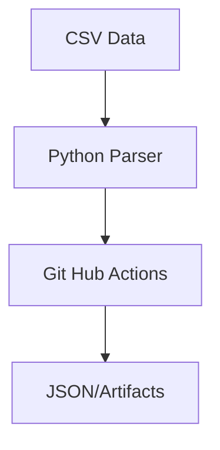

# Cloud IAM Security Auditor

## 1. Objective

A Python-based utility that automates the principle of Least Privilege by auditing AWS/Azure IAM reports for MFA compliance and key rotation.

This tool allows security teams to identify non-compliant users at scale, effectively reducing the attack surface by highlighting stale credentials and missing MFA policies.

---

## 2. Achitecture Diagram


---

## 3. Features

- Automated IAM credential rotation auditing.

- MFA enforcement verification.

- Cloud-native CI/CD integration with GitHub Actions.

- Log rotation and structured JSON/Text reporting.

---


## 4. Prerequisites

Python 3.8+, pip, and git installed on your local machine.

---

## 5. Usage

### Step 1: Generating mock data 

To ensure we are not committing any real API keys or sensitive data we use a 500-row fake data generator.

```bash
    python3 generate_iam_report.py
```

### Step 2: Generating IAM security compliance report

Using a python-based .txt and .json report generator that check checks for enabled MFA policy and rotation key dynamically.

```bash
    python3 iam_security_compliance.py -f iam_report.csv -d 90 # -f <file> -d <rotation_key_threshold> (days)
```

### Step 3: Set up GitHub Actions

#### Step 3.1.: Create a `.gitignore`

To avoid logs, timestamps and reports to be part of the repo.

```Bash
    echo "logs/" >> .gitignore
    echo "*.json" >> .gitignore
    echo "iam_security_compliance_report*.txt" >> .gitignore
```

### Step 3.2.: Create a GitHub Repository

1. Go to [GitHub](https://github.com) and create a new repository named `iam-audit-tool`.
    
2. In production  environment we keep it **Private** if your CSV contains real user data.
    
3. Link local folder to GitHub:
    
```bash
    git remote add origin https://github.com/YOUR_USERNAME/iam-audit-tool.git
    git add .
    git commit -m "Initial commit: IAM security tool and sample data"
    git branch -M main
    git push -u origin main
```

### Step 3.3.: Define the Workflow

GitHub Actions look for YAML files in a specific hidden folder: `.github/workflows/`.

1. **Create the folder:**
    
```bash
    mkdir -p .github/workflows
```
    
2. **Create the workflow file:** `touch .github/workflows/daily_audit.yml`

#### Step 3.4: Write the Workflow Logic

Open `daily_audit.yml` and paste this configuration. This tells GitHub to run your Python script every time you push code, or on a schedule.

### Step 4: Deploy and Trigger

Now, push this configuration to GitHub.

1. **Push the changes:**
    
```bash
    git add .github/workflows/daily_audit.yml
    git commit -m "Add GitHub Action workflow"
    git push origin main
```
    
2. **Watch it run:**
    
    - Go to your GitHub Repository in your browser.
        
    - Click the **"Actions"** tab.
        
    - You should see "IAM Security Compliance Audit" running.
        
    - Once it finishes, click on the run to see the **Artifacts** available for download.

---